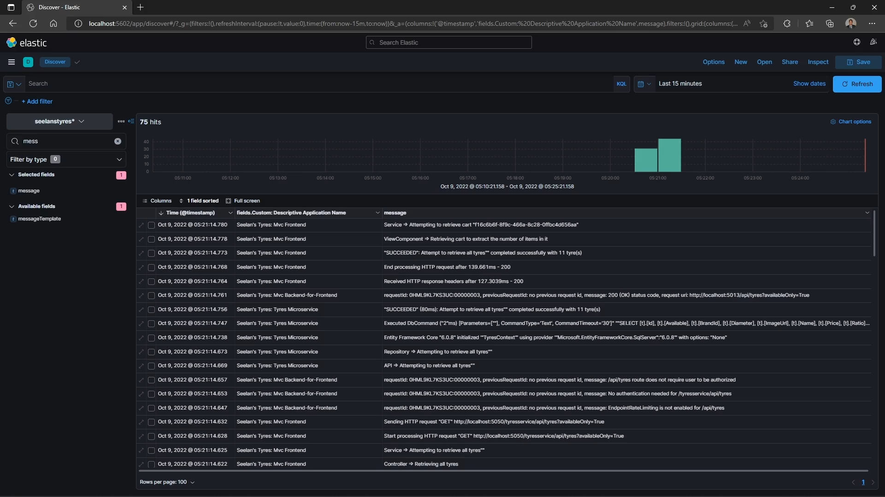
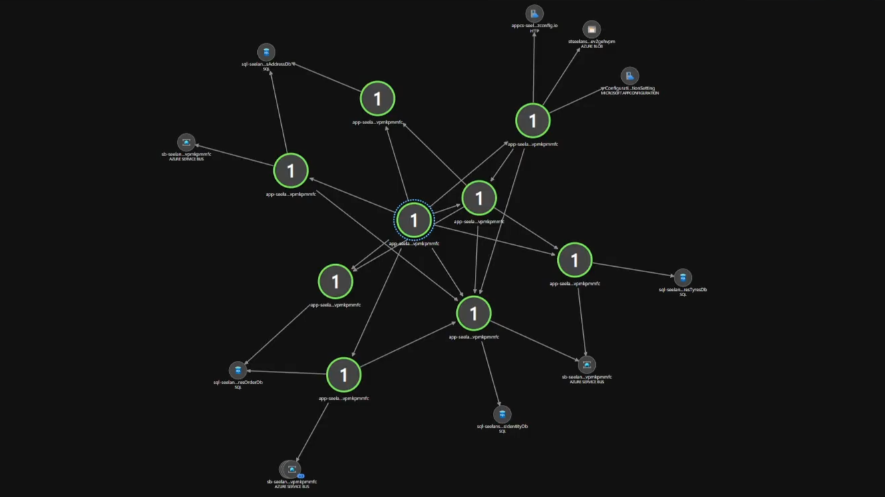

# Seelan's Tyres

| Solution | Build Status |
| :------: | :----------: |
| Main     | [](https://dev.azure.com/Shaylen/Personal/_build/latest?definitionId=14&branchName=master) |
| SeelansTyres-Frontends-HealthChecksUISolution | [](https://dev.azure.com/Shaylen/Personal/_build/latest?definitionId=6&branchName=master) |
| SeelansTyres-Frontends-MvcSolution | [](https://dev.azure.com/Shaylen/Personal/_build/latest?definitionId=7&branchName=master) |
| SeelansTyres-FunctionApps-SystemDegradedTogglerSolution | [](https://dev.azure.com/Shaylen/Personal/_build/latest?definitionId=15&branchName=master) |
| SeelansTyres-Gateways-MvcBffSolution | [](https://dev.azure.com/Shaylen/Personal/_build/latest?definitionId=8&branchName=master) |
| SeelansTyres-Services-AddressServiceSolution | [](https://dev.azure.com/Shaylen/Personal/_build/latest?definitionId=9&branchName=master) |
| SeelansTyres-Services-IdentityServiceSolution | [](https://dev.azure.com/Shaylen/Personal/_build/latest?definitionId=10&branchName=master) |
| SeelansTyres-Services-OrderServiceSolution | [](https://dev.azure.com/Shaylen/Personal/_build/latest?definitionId=11&branchName=master) |
| SeelansTyres-Services-TyresServiceSolution | [](https://dev.azure.com/Shaylen/Personal/_build/latest?definitionId=12&branchName=master) |

[](https://sonarcloud.io/summary/new_code?id=ShaylenReddy42_Seelans-Tyres)

## What's the purpose of this project?

This project is a rewrite of my [original college project](https://bitbucket.org/Shaylen/seelans-tyres/src/master/) which - compared to this - was very poorly written and insecure

Originally, it was written using PHP [by force, not choice]. This is written using C# and .NET 6 and 7

It's also rewritten to utilize my Azure and DevOps skills since I had earned Microsoft's Azure Certifications and needed a way to prove my skills with a project

View the AZ-400 that I prepared for and took [here](docs/az-400/README.md)

As of right now, the solution is completed locally and is almost ready for Azure

Initially I intended to make it cloud-native but I'd rather have it cloud-ready since "native" means it only runs in the cloud

The definition of "cloud-native" seems to be up for debate from what I've seen and it makes sense as to why it is one

NOTE: Since this project is a proof-of-concept, the payment system isn't integrated

## Architecture

### Where it started

In the beginning, it was a distributed monolith with a frontend and backend API with a single database shared between both the projects

### Where it is

The API has been broken down into microservices which then invited a backend-for-frontend to have a single point of entry into the microservices from the frontend

The solution now comprises of 10 runnable projects with 17 projects in total

## Features

### Website features

* A very simple and easy to navigate user interface
* An Admin Portal protected by ASP.NET Core Identity
  * Admin Portal features:
    * View the database structure [even though it's split]
    * Add and update tyre catalog with the ability to add and update images
    * View undelivered orders and mark them as delivered
    * View the receipt of an order
  * Related commits:
    * [admin: efficiently use the partial view for the tyres table](https://github.com/ShaylenReddy42/Seelans-Tyres/commit/7b3f628fee9f311cf9e6faff5dba51d7aba1694e)
    * [implement functionality to add tyres](https://github.com/ShaylenReddy42/Seelans-Tyres/commit/2ae5c6541bd3c6679948e2ab3df4b9cfff2af7ae)
    * [implement functionality for updating tyres](https://github.com/ShaylenReddy42/Seelans-Tyres/commit/402361b0a1e389c102b2dbe2538d0ae6c32dfd98)
    * [implement the logic for the shopping cart and the placing of orders](https://github.com/ShaylenReddy42/Seelans-Tyres/commit/4b50f068b9f3919ba83bc8cb8875e514b67ee97d)
    * [implement the viewing of orders in the admin portal](https://github.com/ShaylenReddy42/Seelans-Tyres/commit/d8590b24c3ee38a02470083e68afe05dad58aa11)
    * [implement the viewing of receipts from the admin portal](https://github.com/ShaylenReddy42/Seelans-Tyres/commit/908746b5c182d5872553938b3284e091ffd01b77)
    * [admin portal: use restful routing for updating a tyre](https://github.com/ShaylenReddy42/Seelans-Tyres/commit/a57625efb6dd5110f226d5830dbfef1207e19b0b)
    * [add a missing feature to set the tyre's availability and adjust what customers see accordingly](https://github.com/ShaylenReddy42/Seelans-Tyres/commit/8209ac8a41e6cd6ce76a038621c3c8d17babfecf)
    * [create an image service](https://github.com/ShaylenReddy42/Seelans-Tyres/commit/0f3c1cca9777e1e38bf9bda8f67172e1367ab956)
    * [azure: implement the cloud version of the image service](https://github.com/ShaylenReddy42/Seelans-Tyres/commit/71ebfb0faf41d9e26796e5f9f24093338cd5280a)
    * [the blob client has the uri 😐](https://github.com/ShaylenReddy42/Seelans-Tyres/commit/c53f9b54d3af1b326459a90b2355e4a0662801ad)
* A custom footer with a link to the commit on GitHub referencing the version its built on
  * Related commits:
    * [update the footer to include the version and a link to the commit in github](https://github.com/ShaylenReddy42/Seelans-Tyres/commit/1322343c75e48a07223633ec7e1841cbf0e503c9)
* Customers can perform updates to their account, add addresses, view their previous orders, reset their password and delete their account
  * Related commits:
    * [implement the logic for addresses in the account](https://github.com/ShaylenReddy42/Seelans-Tyres/commit/a8d41adcefcaa2f0a495643fa3afa4ceb962bb29)
    * [fix the post request for add new address](https://github.com/ShaylenReddy42/Seelans-Tyres/commit/fae3a5fb89edf71098061e90386981f55fb6fbcf)
    * [implement the logic for the shopping cart and the placing of orders](https://github.com/ShaylenReddy42/Seelans-Tyres/commit/4b50f068b9f3919ba83bc8cb8875e514b67ee97d)
    * [implement the viewing of orders on the account](https://github.com/ShaylenReddy42/Seelans-Tyres/commit/b09d30c2877563e5feaa587708a134c4fcd428c5)
    * [account: ensure a customer makes their first address a preferred one](https://github.com/ShaylenReddy42/Seelans-Tyres/commit/e7674dd8a519f8963f4b813bd34578cd4e7d7efc)
    * [implement the functionality to reset password](https://github.com/ShaylenReddy42/Seelans-Tyres/commit/1186c2967f6a8eda1e3a244718137e80e2d7ad31)
* An email service that sends emails with FluentEmail using embedded razor templates
  * Emails sent:
    * A receipt when a user completes an order
    * Sends the user a token to reset their password
  * Related commits:
    * [:D send an email when a customer completes an order](https://github.com/ShaylenReddy42/Seelans-Tyres/commit/dc525ca49350d4c00c24d8fb9daaf53bf1c406da)
    * [implement the functionality to reset password](https://github.com/ShaylenReddy42/Seelans-Tyres/commit/1186c2967f6a8eda1e3a244718137e80e2d7ad31)

### Security features

* The entire architecture is protected using IdentityServer4
  * Related commits:
    * [implement identityserver4](https://github.com/ShaylenReddy42/Seelans-Tyres/commit/6d1255cd3d4a1aafe97b50f8227b7de548328a23)
    * [implement an api gateway with ocelot](https://github.com/ShaylenReddy42/Seelans-Tyres/commit/ce2817ea68efdd1de72d4b941d654d09cfe1d537)
    * [cleanup the token exchange logic](https://github.com/ShaylenReddy42/Seelans-Tyres/commit/8a95649f643a3cedabfb6718b1399c87a133c412)
* User login session management
* Hybrid-encryption for customer data on POST and PUT requests
  * Related commits:
    * [secure the customers api with hybrid encryption](https://github.com/ShaylenReddy42/Seelans-Tyres/commit/88c0a20ddbd5e696753647ef96bec54a30cbb25c)
    * [make some slight improvements](https://github.com/ShaylenReddy42/Seelans-Tyres/commit/90c9cca1ecefd3d3fd8d1f629b5db33d9f478183)
    * [prep for containerization and orchestration locally](https://github.com/ShaylenReddy42/Seelans-Tyres/commit/2ef94c9565db5e77a8532aa69e54954bab1dc9f4)
    * [cryptography: remove hmac computation](https://github.com/ShaylenReddy42/Seelans-Tyres/commit/565576215da7ca38124c64456e3a9656d7396101)
* Custom authorization requirements and policies for customers and the administrator. Customers can only access their own data
  * Related commits:
    * [implement identityserver4](https://github.com/ShaylenReddy42/Seelans-Tyres/commit/6d1255cd3d4a1aafe97b50f8227b7de548328a23)
    * [authorization: fix the issue of the role claim missing in the access token](https://github.com/ShaylenReddy42/Seelans-Tyres/commit/f03cfc8b73c1f3114b4d58556770335cd688c43e)

### API features

* Utilizing the repository pattern to access the database and perform CRUD operations
* AutoMapper is used to map between database entities and models returned to the client
* Using middleware to return a ProblemDetails model when a non-success status code is returned
  * Related commits:
    * [improve the error responses returned from the microservices](https://github.com/ShaylenReddy42/Seelans-Tyres/commit/7741813f0c61d8191a33397cc56b19c375d7ac37)
* Protected by IdentityServer4 and custom authorization policies
  * Related commits:
    * [implement identityserver4](https://github.com/ShaylenReddy42/Seelans-Tyres/commit/6d1255cd3d4a1aafe97b50f8227b7de548328a23)
* [WIP] An efficient API versioning strategy
  * Related commits:
    * [resolve some of the duplication](https://github.com/ShaylenReddy42/Seelans-Tyres/commit/e6c595302a3290ba0e7610bbade60d53c8df9081)
    * [cleanup: centralize models-library using statements in a globalusings.cs file](https://github.com/ShaylenReddy42/Seelans-Tyres/commit/4c43efca9f119a64a8ba8f0cd97dc2ae958ecec1)
    * [models: align with the semver versioning strategy and introduce model wrappers](https://github.com/ShaylenReddy42/Seelans-Tyres/commit/12f290fde2fe1bb56775a1e5f4d3b6af10cd4f6c)
    * [models: allow backwards compatibility](https://github.com/ShaylenReddy42/Seelans-Tyres/commit/0dc1973606c16aad47c5a1f82d2bf0af3256ee42)
    * [models: introduce a static class called AvailableModels that's tied to a version of the models and allow the model type to be specified in the model wrapper](https://github.com/ShaylenReddy42/Seelans-Tyres/commit/7e312938d05680a8298b70bae294221a4f75dbdc)
    * [models: the model version doesn't need to be static](https://github.com/ShaylenReddy42/Seelans-Tyres/commit/b8b3ef04004ca5e9b6d6854bebaba0ac539671da)

### Architecture features

* An API Gateway to have a single point of entry into the microservices as exposing the APIs to the world without it is not a best practice
  * Related commits:
    * [implement an api gateway with ocelot](https://github.com/ShaylenReddy42/Seelans-Tyres/commit/ce2817ea68efdd1de72d4b941d654d09cfe1d537)
* Effectively dealing with cross-cutting concerns like logging and distributed tracing
  * Related commits:
    * [prep for centralized logging with serilog and elasticsearch](https://github.com/ShaylenReddy42/Seelans-Tyres/commit/08bd63d906e416078cdd01d3db82c099a1e35922)
    * [the days and nights were long and so too, was the logging spree](https://github.com/ShaylenReddy42/Seelans-Tyres/commit/3fe627984d17f80bdc38ad73a2f5e43480ae5f88)
    * [containerize and MOSTLY orchestrate the solution locally](https://github.com/ShaylenReddy42/Seelans-Tyres/commit/673d44990c0a2b778a3f97ad6a27cddb41d2ad9d)
    * [centralize the logging configuration in a shared library](https://github.com/ShaylenReddy42/Seelans-Tyres/commit/811c326c95d489c3f8fd2566bb9cc7c581d0cdbf)
    * [implement rabbitmq and complete the architecture locally](https://github.com/ShaylenReddy42/Seelans-Tyres/commit/9619457579b512a92817695b67ce0acdf668e486)
    * [implement a more correct way to maintain distributed tracing over a message bus](https://github.com/ShaylenReddy42/Seelans-Tyres/commit/88030bd61445d5ffcd447529f7a799f20fbd80e3)
    * [okay, duplication is a bit too high](https://github.com/ShaylenReddy42/Seelans-Tyres/commit/b808f4f94ad323df019d156223c3b8c06f541e50)
* The codebase version with a link to the commit on GitHub is used to enrich the logs. This is useful in the following ways:
  * Tracing back to new code that's causing failures to occur
  * In a system where security is a priority, if a developer goes rogue and decides to allow fraud to occur by modifying the code, it can be traced back to them and can be under investigation
    * CODE REVIEWS ARE IMPORTANT
  * Related commits:
    * [prep for centralized logging with serilog and elasticsearch](https://github.com/ShaylenReddy42/Seelans-Tyres/commit/08bd63d906e416078cdd01d3db82c099a1e35922)
* An efficient data synchronization strategy across microservices
  * Related commits:
    * [implement rabbitmq and complete the architecture locally](https://github.com/ShaylenReddy42/Seelans-Tyres/commit/9619457579b512a92817695b67ce0acdf668e486)
    * [rework how updates are published by making it more resilient to failure](https://github.com/ShaylenReddy42/Seelans-Tyres/commit/74779db7ad0f933d613037e405aca1eb1abdd3e0)
    * [azure: implement the cloud version of pub-sub](https://github.com/ShaylenReddy42/Seelans-Tyres/commit/34431c77768a5c578452b662506270dd4e0730b4)
* Site Reliability Engineering possibilities like creating an actionable alerting strategy and monitoring application health
  * Related commits:
    * [the days and nights were long and so too, was the logging spree](https://github.com/ShaylenReddy42/Seelans-Tyres/commit/3fe627984d17f80bdc38ad73a2f5e43480ae5f88)
    * [communicate to users that the system is degraded](https://github.com/ShaylenReddy42/Seelans-Tyres/commit/1d9b24774178902cbc0336221933f358b7f67a47)
    * [implement application health checks](https://github.com/ShaylenReddy42/Seelans-Tyres/commit/254d8c94aaff44964f56b31dafe1fb10fbc93de5)
    * [enable the system degraded state by default when using docker compose](https://github.com/ShaylenReddy42/Seelans-Tyres/commit/b26dac1ac5ff811be2a8711ca31fd290379fe1bb)
    * [implement liveness checks](https://github.com/ShaylenReddy42/Seelans-Tyres/commit/8e5581c21e91ae2ce6f255bd1e92d617277ac6b0)
    * [perform the liveness checks from the health checks ui](https://github.com/ShaylenReddy42/Seelans-Tyres/commit/59f1d9694ee5200d9e068a8839f072132012bc5a)
    * [azure: instrument the solution with application insights telemetry](https://github.com/ShaylenReddy42/Seelans-Tyres/commit/dfd858a997258584e1d8b81bb9840519e8021987)
    * [overhaul the existing health checks](https://github.com/ShaylenReddy42/Seelans-Tyres/commit/4011f2761eda155aa2b26aba3a9d492fecfcd18a)
    * [implement environment specific health checks](https://github.com/ShaylenReddy42/Seelans-Tyres/commit/0c8c98aa05f678c3f2ec932ce3133d152862e07b)
    * [azure: implement the system-degraded toggler azure function app](https://github.com/ShaylenReddy42/Seelans-Tyres/commit/b1a2d1885fc53cc2c7c4c86e97000d4bbee2256d)

### Codebase / Build System features

* An easy-to-maintain codebase that's polyrepo-ready
  * Related commits:
    * [restructure and reorganize the entire solution](https://github.com/ShaylenReddy42/Seelans-Tyres/commit/14c11fb8414c71f03fa8ad7d60cf828cb1dcb58a)
* A build system optimized with CMake to make the local building and running of the solution seamless
  * Related commits:
    * [containerize and MOSTLY orchestrate the solution locally](https://github.com/ShaylenReddy42/Seelans-Tyres/commit/673d44990c0a2b778a3f97ad6a27cddb41d2ad9d)
    * [cmake: templatize the run script](https://github.com/ShaylenReddy42/Seelans-Tyres/commit/6b204c9581c4d4fbf96e00c26a52c0e9aebb36ac)
    * [cmake: make the configure files more maintainable](https://github.com/ShaylenReddy42/Seelans-Tyres/commit/bc683f940094e80e3dfbe2ec00da93c5f49f3195)
    * [cmake: templatize the copying of publish files](https://github.com/ShaylenReddy42/Seelans-Tyres/commit/9d8708cd1ca47ea28c513352eac491bb7db8298f)
    * [cmake: templatize runall.cmd](https://github.com/ShaylenReddy42/Seelans-Tyres/commit/b7ff17c81d99b8d2f35a341c420ac023844b1f6a)
    * [cmake: templatize the publishing of a project](https://github.com/ShaylenReddy42/Seelans-Tyres/commit/eea327d6d3909cc081039b5182b69e748cb98926)
* All projects are versioned according to the codebase version
* Little (unavoidable) technical debt due to necessary code duplication
* Sonarcloud is used to provide feedback on technical debt to which I take and clean up the solution
  * Related commits:
    * [integrate sonarcloud](https://github.com/ShaylenReddy42/Seelans-Tyres/commit/a01b34b3c0b412652a896c1bf14cc8b65c5735db)

## Resources that helped me skill up to rewrite this project

### Textbooks

* [C# 10 and .NET 6 [Paperback]](https://www.amazon.com/10-NET-Cross-Platform-Development-websites/dp/1801077363/ref=tmm_pap_swatch_0?_encoding=UTF8&qid=&sr=)
  * Author: Mark J. Price

### Pluralsight 

#### Paths

* [Designing and Implementing Microsoft DevOps Solutions (AZ-400)](https://www.pluralsight.com/paths/designing-and-implementing-microsoft-devops-solutions-az-400)
  * Authors: John Savill | David Tucker | Neil Morrissey | Marcel de Vries | Chris Behrens | Adam Bertram | Daniel Krzyczkowski
* [Developing Solutions for Microsoft Azure (AZ-204)](https://www.pluralsight.com/paths/developing-solutions-for-microsoft-azure-az-204)
  * Authors: Matthew Kruczek | Anthony Nocentino | Mike Pfeiffer | Mark Heath | David Tucker | Thomas Claudius Huber | Sahil Malik | Reza Salehi | James Millar | Daniel Krzyczkowski | Matthew Soucoup
* [ASP.NET Microservices](https://www.pluralsight.com/paths/net-microservices)
  * Authors: Antonio Goncalves | Roland Guijt | Gill Cleeren | Neil Morrissey | Kevin Dockx | Mark Heath | Marcel de Vries | Steve Gordan | Rag Dhiman
* [Certified Kubernetes Administrator (CKA)](https://www.pluralsight.com/paths/certified-kubernetes-administrator)
  * Author: Anthony Nocentino

#### Individual courses

* [Building a Web App with ASP.NET Core 5, MVC, Entity Framework Core, Bootstrap, and Angular](https://www.pluralsight.com/courses/aspnetcore-mvc-efcore-bootstrap-angular-web)
  * Author: Shawn Wildermuth
* [ASP.NET Core 6 Web API Fundamentals](https://www.pluralsight.com/courses/asp-dot-net-core-6-web-api-fundamentals)
  * Author: Kevin Dockx
* [ASP.NET Core 6 Fundamentals](https://www.pluralsight.com/courses/asp-dot-net-core-6-fundamentals)
  * Author: Gill Cleeren
* [Your Microservices Transition](https://www.pluralsight.com/courses/your-microservices-transition)
  * Author: Rag Dhiman
* [Microservices Architecture: The Design Principles](https://www.pluralsight.com/courses/microservices-design-principles)
  * Author: Rag Dhiman
* [Securing ASP.NET Core 3 with OAuth2 and OpenID Connect](https://www.pluralsight.com/courses/securing-aspnet-core-3-oauth2-openid-connect)
  * Author: Kevin Dockx
* [Cryptography in .NET 6](https://www.pluralsight.com/courses/dot-net-6-cryptography)
  * Author: Stephen Haunts
* [Logging and Monitoring in ASP.NET Core 6](https://www.pluralsight.com/courses/logging-monitoring-aspdotnet-core-6)
  * Author: Erik Dahl
* [RabbitMQ by Example](https://www.pluralsight.com/courses/rabbitmq-by-example)
  * Author: Stephen Haunts
* [Building ASP.NET Core 3 Hosted Services and .NET Core 3 Worker Services](https://www.pluralsight.com/courses/building-aspnet-core-hosted-services-net-core-worker-services)
  * Author: Steve Gordan
* [Fundamentals of Docker and Kubernetes for .NET 5 Developers](https://www.pluralsight.com/courses/docker-kubernetes-dot-net-developers-fundamentals)
  * Author: Erik Dahl
* [Deploying ASP.NET Core 6 Using Kubernetes](https://www.pluralsight.com/courses/asp-dot-net-core-6-kubernetes)
  * Author: Marcel de Vries
* [Securing ASP.NET Core 6 with OAuth2 and OpenID Connect](https://www.pluralsight.com/courses/asp-dot-net-core-6-securing-oauth-2-openid-connect)
  * Author: Kevin Dockx
* [Deploying Azure Resources Using Bicep](https://www.pluralsight.com/courses/deploying-azure-resources-using-bicep)
  * Author: Ben Weissman
* [The IT Ops Sessions: ARM Templates vs. Terraform](https://www.pluralsight.com/courses/arm-templates-terraform-it-ops-sessions)
  * Author: Tim Warner

### Whizlabs

* [Exam AZ-400: Designing and Implementing Microsoft DevOps Solutions](https://www.whizlabs.com/microsoft-azure-certification-az-400/)
  * Author: ???

### YouTube

#### Channels

* [John Savill's Technical Training](https://www.youtube.com/@NTFAQGuy)
  * Author: John Savill

#### Videos

* [Sending Email in C# using FluentEmail](https://www.youtube.com/watch?v=qSeO9886nRM)
  * Author: IAmTimCorey
* [Intro to Health Checks in .NET Core](https://www.youtube.com/watch?v=Kbfto6Y2xdw)
  * Author: IAmTimCorey
* [Intro to Redis in C# - Caching Made Easy](https://www.youtube.com/watch?v=UrQWii_kfIE)
  * Author: IAmTimCorey
* [RabbitMQ Custom Docker Image with Custom Configuration and Definitions](https://www.youtube.com/watch?v=I8QHPfMhqAU)
  * Author: Mike Møller Nielsen
* [Leveling up data: Upgrade from EF6 to EF7 and blast off! | .NET Conf 2022](https://www.youtube.com/watch?v=1U02rnSaz9Q)
  * Author: dotnet
* [Authoring and deploying Azure resources with Bicep | Azure Friday](https://www.youtube.com/watch?v=VDCAJIGqHZU)
  * Author: Microsoft Azure

### Docs, forums and articles

* [Microsoft Learn](https://learn.microsoft.com/en-us/)
* [Stack Overflow](https://stackoverflow.com/) [Obviously]
* [How export or import RabbitMQ configuration](https://sleeplessbeastie.eu/2020/03/18/how-export-or-import-rabbitmq-configuration/)
* [Docker Security Cheat Sheet](https://cheatsheetseries.owasp.org/cheatsheets/Docker_Security_Cheat_Sheet.html)

## Required local setup to build and run

* [Visual Studio 2022](https://visualstudio.microsoft.com/downloads/) 17.5 or later
* .NET SDK [6.0.406](https://dotnet.microsoft.com/en-us/download/dotnet/6.0) and [7.0.200](https://dotnet.microsoft.com/en-us/download/dotnet/7.0)
* [CMake](https://cmake.org/download/) 3.21.4 or later
* An Instance of [SQL Server 2022 Express](https://www.microsoft.com/en-us/sql-server/sql-server-downloads) [Default, not named]
* [SQL Server Management Studio](https://docs.microsoft.com/en-us/sql/ssms/download-sql-server-management-studio-ssms?view=sql-server-ver16)
* [Docker Desktop](https://www.docker.com/products/docker-desktop/)
* [PowerToys](https://github.com/microsoft/PowerToys/releases) 0.65.0 or later [For the hosts file editor]

## Build instructions

* NOTE: If you use `build-with-docker.cmd`, I recommend you pull these images beforehand:

``` bat

docker pull elasticsearch:7.17.9
docker pull kibana:7.17.9
docker pull nginx:latest
docker pull rabbitmq:3-management
docker pull redis:latest

docker pull mcr.microsoft.com/dotnet/aspnet:6.0-alpine
docker pull mcr.microsoft.com/dotnet/sdk:6.0-alpine

docker pull mcr.microsoft.com/dotnet/aspnet:7.0-alpine
docker pull mcr.microsoft.com/dotnet/sdk:7.0-alpine

docker pull mcr.microsoft.com/mssql/server:2022-latest

```

* If you use `build-with-services.cmd`, pull only these images beforehand:

``` bat

docker pull elasticsearch:7.17.9
docker pull kibana:7.17.9
docker pull rabbitmq:3-management

```

* Ensure to set environment variables listed in the `RequiredEnvironmentVariables.txt` file
  * Press <kbd>🪟</kbd> and search for `Edit environment variables for your account`
  * When setting this for the first time, restart your computer
* All build scripts are in the `scripts` folder
* In order to build, I've provided four options for you:
  * `build.cmd` which is the regular build
  * `build-with-docker.cmd` to run with docker-compose
  * `build-with-services.cmd` which is the regular build + elasticsearch, kibana and rabbitmq orchestrated with docker-compose
  * Kubernetes:
    * All scripts for Kubernetes are in the `scripts/kubernetes` folder and should be run in order
      * `00-applied-once.cmd`
        * Note: This adds the nginx ingress to the cluster from the original repo
      * `01-build-images.cmd`
      * `02-deploy.cmd`
      * `03-delete.cmd`

* Once you run either `build.cmd` or `build-with-services.cmd`, CMake will generate `run-all.cmd`
* Thereafter, run `run-all.cmd` which will start all applications minimized and launch the site, simulating orchestration

## Demos

### Setting up Kibana and demonstrating distributed tracing

[](https://drive.google.com/file/d/1aVM_LosrVu2S6ZnN9Vc6IdDNI87_28la/view "Setting Up Kibana and Demonstrating Distributed Tracing")

### Solution in Azure

[](https://drive.google.com/file/d/1IHLi6Q6hsFGMJCS53Y3Mb-hEVU8LyZ_8/view "Solution in Azure")
